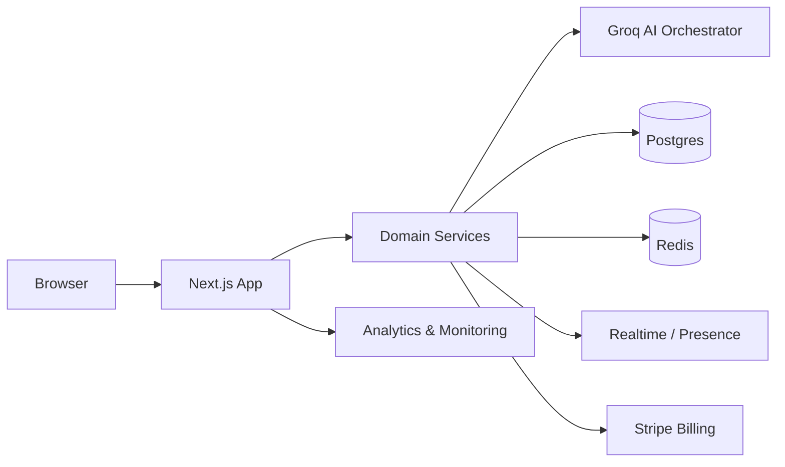

<div align="center">

# ◈ RetroAI

### A living AI companion with a neon soul.

**RetroAI brings the emotional magic of classic digital pets into a persistent, multiplayer, AI-native world.**

[](https://www.typescriptlang.org/)
[](https://nextjs.org/)
[](https://react.dev/)
[](#license)

<br />

> **Feed it. Talk to it. Shape who it becomes.**
>
> A retro-futuristic digital pet that remembers, evolves, and grows with its caretakers.

</div>

---

## ✦ The pitch

In 1989, a tiny screen made people care through a simple loop: **feed, play, clean, repeat**.

RetroAI keeps that emotional core and gives it a modern nervous system:

- **AI personality evolution** — your companion develops a distinct voice and behavior over time.
- **Persistent memory** — important moments become part of its timeline instead of disappearing between sessions.
- **Shared care** — multiple people can look after the same companion in real time.
- **Explainable intelligence** — inspect the companion's decisions through a playful retro debug console.
- **Production-minded foundations** — persistence, rate limits, billing, observability, and testing are designed in from the start.

## ⚡ What you can do

| Experience | What it means |
| --- | --- |
| 🥣 **Care loop** | Feed, play, clean, rest, and discipline your companion. Every action matters. |
| 💬 **Talk naturally** | Have streaming conversations powered by Groq and a memory-aware persona. |
| 🧠 **Build a personality** | Repeated interactions influence mood, traits, preferences, and future responses. |
| 🕹️ **Switch eras** | Toggle the retro skin, synthesize Web Audio beeps, and enter 80s mode. |
| 👥 **Care together** | Share presence, actions, events, and leaderboard updates with other caretakers. |
| ⏪ **Revisit history** | Save snapshots, replay the timeline, and preserve the story of your companion. |
| 📊 **Understand behavior** | Explore heatmaps, timelines, weekly summaries, and anomaly signals. |
| 💳 **Go beyond free** | Freemium tiers, credits, Stripe checkout, and webhook routes are scaffolded. |

## 🧩 How it fits together



### Architecture at a glance

- **Frontend + API:** Next.js App Router and Route Handlers
- **AI:** Groq streaming client abstraction with memory-aware responses
- **Canonical state:** Postgres through Drizzle ORM
- **Performance + limits:** Redis cache and rate-limiting primitives
- **Realtime:** Supabase-compatible presence and event patterns
- **Billing:** Stripe subscriptions, checkout, and webhook scaffolding
- **Observability:** Sentry and PostHog integration points
- **Quality:** Vitest coverage and Playwright end-to-end tests

Read the full system design in [**ARCHITECTURE.md**](ARCHITECTURE.md).

## 🛠️ Built with

<div align="center">

| Layer | Technology |
| --- | --- |
| App | Next.js 16 · React 19 · TypeScript · Tailwind CSS |
| AI | Groq SDK · Llama 3.3 70B versatile |
| Data | PostgreSQL · Drizzle ORM · Redis |
| Platform | Supabase-compatible realtime patterns · Stripe |
| Reliability | Sentry · PostHog · Zod validation |
| Testing | Vitest · Testing Library · Playwright |
| Runtime | Node.js 20+ · Docker |

</div>

## 🚀 Run it locally

### Prerequisites

- [Node.js 20.10+](https://nodejs.org/)
- [Docker Desktop](https://www.docker.com/products/docker-desktop/) for local Postgres and Redis

### 1. Install dependencies

```bash
npm install
```

### 2. Configure the environment

```bash
cp .env.example .env
```

Add the values needed for your setup:

```env
GROQ_API_KEY=your_groq_key
DATABASE_URL=your_postgres_url
REDIS_URL=your_redis_url
NEXTAUTH_SECRET=your_auth_secret
STRIPE_SECRET_KEY=your_stripe_secret
```

### 3. Start local infrastructure

```bash
docker compose up -d
```

### 4. Start RetroAI

```bash
npm run dev
```

Open [http://localhost:3000](http://localhost:3000) and meet your companion.

## 📜 Commands

| Command | Purpose |
| --- | --- |
| `npm run dev` | Start the web app in development mode |
| `npm run build` | Create a production build |
| `npm run lint` | Run the app linter |
| `npm run test` | Run unit tests with coverage |
| `npm run test:e2e` | Run Playwright smoke and end-to-end tests |
| `npm run db:generate` | Generate Drizzle artifacts |
| `npm run db:migrate` | Apply database migrations |
| `npm run changelog` | Generate a changelog from repository history |

## 🗂️ Repository map

```text
.
├── apps/
│   └── web/
│       ├── src/app/          # Pages, layouts, routes, and API handlers
│       ├── src/features/     # Product feature modules
│       ├── src/components/   # UI and retro interaction primitives
│       └── src/lib/          # AI, DB, billing, cache, env, and monitoring
├── packages/
│   ├── ui/                   # Shared UI package
│   └── types/                # Shared domain types
├── docs/
│   ├── openapi.yaml          # API contract
│   ├── demo-script.md        # Three-minute demo talk track
│   ├── pitch-deck-outline.md # Ten-slide pitch outline
│   └── production-checklist.md
├── ARCHITECTURE.md           # Detailed architecture and system decisions
└── docker-compose.yml        # Local service definitions
```

## 📚 Documentation

- [Architecture](ARCHITECTURE.md)
- [API contract](docs/openapi.yaml)
- [Architecture decision record](docs/adr/0001-architecture.md)
- [Demo script](docs/demo-script.md)
- [Pitch deck outline](docs/pitch-deck-outline.md)
- [Production checklist](docs/production-checklist.md)
- [Contributing guide](CONTRIBUTING.md)

## ☁️ Deployment

The recommended deployment path is:

- **Web/API:** Vercel
- **Database, realtime, and storage:** Supabase
- **Cache and rate limits:** Upstash Redis

A containerized deployment is also supported:

```bash
docker build -t retroai .
docker run --env-file .env -p 3000:3000 retroai
```

## 🧭 Project status

RetroAI is an actively evolving product prototype with production-oriented foundations. The current focus is turning the core companion loop into a polished, reliable experience while expanding multiplayer depth, memory, and analytics.

### Next up

- [ ] Polish onboarding and first-companion creation
- [ ] Expand personality and memory evaluation coverage
- [ ] Complete realtime synchronization flows
- [ ] Add richer companion customization
- [ ] Harden deployment and operational runbooks

## 🤝 Contributing

Ideas, fixes, and experiments are welcome. Start with [**CONTRIBUTING.md**](CONTRIBUTING.md), then open an issue or pull request with a clear description of the change and how you tested it.

## 📄 License

A license will be added before the public showcase release. Until then, please treat this repository as **all rights reserved** unless otherwise noted.

---

<div align="center">

**Made with nostalgia, TypeScript, and a suspicious number of neon pixels.**

</div>
